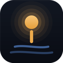

<h1 align="center">
  <br>
  LocalDock
</h1>

<p align="center">
  A lightweight Windows desktop app for managing your local dev servers from one place —<br>
  start, stop, and monitor every project without juggling a dozen terminal windows.
</p>

<p align="center">
  <a href="https://github.com/rdaiven/localdock/releases/latest"></a>
  
  <a href="LICENSE"></a>
</p>

<br>

If your day-to-day involves bouncing between several local dev servers — a frontend, an API, a couple of side projects — LocalDock gives you one dashboard to control all of them, plus an MCP server so your AI assistant can do the same thing.

<br>

## Features

### Process management

- **Start / stop with one click.** Each project is just a shell command and a working directory — LocalDock runs it and manages the process for you.
- **Reliable shutdown.** Stopping a project kills its entire process tree (via Windows Job Objects), so you never end up with an orphaned `node` process still holding a port.
- **Full console output.** A live log viewer with filtering, one-click copy, and a 2000-line scrollback per project — not just a truncated tail.
- **Live resource stats.** CPU, RAM, and uptime for every running project, read straight off its Job Object.
- **Auto-restart, opt-in.** If a project crashes, LocalDock can bring it back automatically with capped exponential backoff, instead of leaving it dead until you notice.
- **Script chips.** Every script in a project's `package.json` shows up as a clickable chip — no more editing the start command by hand to try a different one.

### Visibility & diagnostics

- **Status at a glance.** A glowing status edge on every row — green while running, amber while starting, red when something needs attention — backed by a running activity log.
- **Smart problem detection.** Port conflicts, missing dependencies, bad start commands, and crashes are diagnosed with a one-click fix, not just a red icon.
- **Finds servers you started elsewhere.** One click scans your machine for dev servers already running outside LocalDock — started by hand, or by an AI assistant's terminal — figures out which folder each one belongs to, and offers to add it.

### Stack orchestration

- **Group projects into a stack.** Tag related projects with a group name and get a single **Start all** / **Stop all** for the whole stack — start-up runs in order (so your API comes up before your frontend), shutdown runs in parallel.
- **Tray controls.** The system tray menu lists every project with a live start/stop toggle, so you can manage your stack without reopening the window.
- **Crash notifications.** An OS notification when a project stops unexpectedly, and again if auto-restart gives up.

### Everyday convenience

- **Lives in your tray.** Close the window and LocalDock keeps managing your servers in the background (toggleable — you can make the close button really quit instead). Optional start-on-login and start-minimized.
- **Projects persist.** Your project list and settings survive restarts; nothing to reconfigure.
- **Jump to your editor or a terminal.** One click from a project row into VS Code, Cursor, or a terminal, already in the right folder.

<br>

## AI / MCP integration

LocalDock runs a local [MCP](https://modelcontextprotocol.io) server, so an AI coding assistant can manage your dev environment directly through the same controls the GUI uses. Anything it starts, stops, or adds shows up in the dashboard exactly like something you did by hand, and vice versa.

Copy the ready-made config from **Settings → AI & MCP** into your assistant's MCP settings:

```json
{ "mcpServers": { "localdock": { "url": "http://127.0.0.1:7420/mcp" } } }
```

| Tool | What it does |
| --- | --- |
| `list_projects` | Lists every saved project with its id, port, framework, group, and run state — the starting point for everything else. |
| `start_project` | Spawns a command as a tracked child process (kill-on-close via a Job Object). |
| `stop_project` | Kills a project's full process tree. |
| `restart_project` | Restarts a running project, reusing the command and directory it started with. |
| `get_console_output` | Reads a project's recent console output — the same feed shown in the log viewer — for diagnosing a failed start. |
| `add_project` | Adds a folder to LocalDock, auto-detecting its framework, start command, and port. |
| `scan_for_servers` | Finds dev servers running on the machine that LocalDock isn't managing yet. |
| `check_port_tool` | Checks whether a port is free, and by what it's occupied if not. |

<br>

## Install

Grab the installer from the [latest release](https://github.com/rdaiven/localdock/releases/latest), run it, done.

## Building from source

**Prerequisites:** Node.js, Rust, and the [Tauri prerequisites](https://tauri.app/start/prerequisites/) for Windows.

```bash
npm install
npm run tauri dev
```

To build a release installer:

```bash
npm run tauri build
```

<br>

## Tech stack

| | |
| --- | --- |
| **Frontend** | React, TypeScript, Zustand, Framer Motion, Vite, and a hand-written design system |
| **Backend** | Rust via [Tauri 2](https://tauri.app), using Windows Job Objects for process-tree lifecycle management |
| **AI integration** | [`rmcp`](https://github.com/modelcontextprotocol/rust-sdk) (official Rust MCP SDK) over Streamable HTTP |

## Platform

LocalDock currently targets Windows, since process-tree management is built on the Windows Job Object API.

## License

MIT
